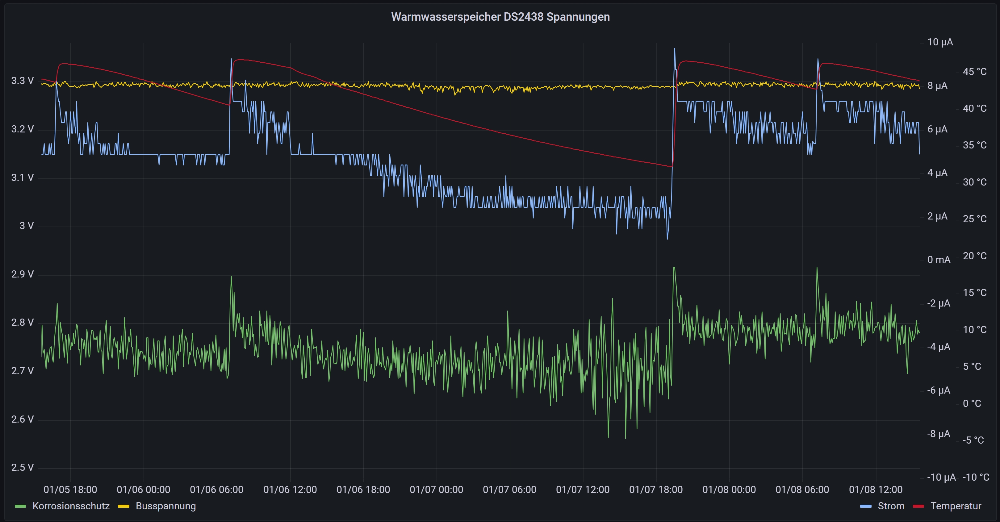

# ESPHome-1-wire

Connecting Maxim's 1-wire devices like DS2438 via ESPHome to Home Assistant.

A robust custom component for **ESPHome** to read temperature, input voltage (VAD), and supply voltage (VDD) from the **Maxim DS2438 Smart Battery Monitor** via the 1-Wire bus.

## 🚀 Key Features

* **Fully Compatible with ESPHome 2025.12+**: Resolves Python class path issues and protected member access (`reset_`) introduced in recent ESPHome updates.
* **Dual Voltage Support**: Measures both **Input Voltage (VAD)** and **Bus Voltage (VDD)** by dynamically reconfiguring the chip's control register.
* **Reliable Data**: Implements the "Recall Memory" sequence to fetch fresh data from internal latches.
* **Stable Timing**: Includes appropriate delays for A/D conversion.

## 📋 Prerequisites

Before using this component, ensure you have:
- **ESP32 or ESP8266** microcontroller board
- **Maxim DS2438 Smart Battery Monitor** IC
- **1-Wire pull-up resistor** (typically 4.7kΩ)
- Basic soldering skills and familiarity with ESPHome
- [ESPHome documentation](https://esphome.io/)
- [DS2438 Datasheet](https://www.maximintegrated.com/en/products/ibutton/ibutton-products/DS2438.html)

## 🛠 Installation
1.  Create a folder named `my_components` in your ESPHome configuration directory (if it doesn't exist).
2.  Create a subfolder `ds2438`.
3.  Copy `sensor.py` and `ds2438.h` into `/config/esphome/my_components/ds2438/`.

Directory structure:
```text
/config/esphome/
├── my_components/
│   └── ds2438/
│       ├── __init__.py
│       ├── sensor.py
│       └── ds2438.h
└── your_device.yaml
```

## 🔌 Hardware Wiring

Connect your DS2438 to your ESP board as follows:

| DS2438 Pin | ESP Pin | Notes |
|-----------|---------|-------|
| DQ (1)    | GPIO4   | Data line (1-Wire bus) with 4.7kΩ pull-up to VDD |
| GND (2)   | GND     | Ground |
| VDD (3)   | 3.3V    | Power supply (can use parasitic power from DQ if needed) |
| VAD (4)   | N/A     | Connect external sensor/battery |

**Finding your DS2438 address**: After configuration, check your ESPHome logs during the first boot to find your device's 1-Wire address. You can also use ESPHome's 1-Wire component debug mode to scan for devices.

## ⚙️ Configuration

Add the following to your ESPHome YAML configuration file:

```yaml
# 1. Define the 1-Wire Bus
one_wire:
  - platform: gpio
    pin: GPIO4
    id: one_wire_bus

# 2. Add the Custom Sensor
sensor:
  - platform: ds2438
    one_wire_id: one_wire_bus
    address: 0xd56dc98711646128
    update_interval: 60s
    temperature:
      name: "Battery Temperature"
    voltage:
      name: "Battery Input Voltage (VAD)"
      unit_of_measurement: "V"
    bus_voltage:
      name: "Bus Supply Voltage (VDD)"
      unit_of_measurement: "V"
```

**Configuration Parameters**:
- `address`: The 1-Wire address of your DS2438 (64-bit hex). Find this in the ESPHome logs after first boot.
- `update_interval`: How often to read the sensor (default: 60s). Increase for slower updates or decrease for more frequent readings.
- `one_wire_id`: Must match the ID defined in your 1-Wire bus configuration.

## 📖 Usage in Home Assistant

Once configured and deployed:

1. The three sensors will appear automatically in Home Assistant
2. Navigate to **Settings → Devices & Services → Entities**
3. Search for your device name (e.g., "Battery Temperature")
4. Add them to your dashboards, automations, or scripts
5. The sensors update at your configured interval (default: 60s)

Example Home Assistant automation:
```yaml
automation:
  - trigger:
      platform: numeric_state
      entity_id: sensor.battery_temperature
      above: 50
    action:
      service: persistent_notification.create
      data:
        message: "Battery temperature is critically high!"
```

## 🔧 Technical Details

The DS2438 shares a single A/D converter for both voltage inputs. This component handles the switching logic automatically, measuring VAD, waiting for conversion, and continuing with VDD.

## 🐛 Troubleshooting

**Values stay at 0.00**: 
Check the ESPHome logs. If you see `Raw Data: 00 00 ...`, the chip might not be powered correctly:
- Ensure **VDD is properly connected** to 3.3V (not just relying on parasitic power)
- Verify the **1-Wire bus pull-up resistor** is correctly installed (4.7kΩ)
- Check that the **A/D conversion time is sufficient** (code uses safe defaults of 100ms)
- Confirm the **device address** is correct in your configuration

**Device not found on bus**:
- Verify GPIO pin number in your `one_wire` configuration
- Check for loose connections or cold solder joints
- Try increasing the `update_interval` to 30 seconds
- Enable debug logging in ESPHome to see 1-Wire bus activity

**Compilation Error: `reset_`**: 
This component uses a C++ access trick to call the protected `reset_()` method of the OneWireBus, which is required for ESPHome versions >= 2025.12. Ensure you're using ESPHome 2025.12 or later.

## ⚠️ Known Limitations

- The component requires **ESPHome 2025.12 or newer** due to API changes
- Only one DS2438 address can be configured per instance (create multiple sensors for multiple devices)
- Requires a stable power supply; parasitic power mode is not recommended for reliable operation
- A/D conversion takes ~100ms; very high update intervals may cause delays

## 📊 Example Output

Once working, your Home Assistant will show:
```
Battery Temperature: 24.5 °C
Battery Input Voltage (VAD): 4.15 V
Bus Supply Voltage (VDD): 3.28 V
```

Example tracking of electrode and bus voltage without Home Assistant integration (only via MQTT and InfluxDB)



## Analysis of Current Data during Heating Cycle
The graph visualizes the electrochemical parameters of a hot water storage tank protected by a titanium impressed current anode. It plots three key metrics over time: the Bus Supply Voltage (VDD), the Anode Potential (VAD) measured against the tank ground, and the Protection Current (I) flowing through the shunt (The shunt has a delibarately low resistance, so as not to impede the corrosion protection. Thus, the current is at the limit of what is directly measurable with the DS2438).
Bus Voltage Stability (VDD): The top line (VDD) remains flat and stable (approx. 3.3V). This confirms that the ESP32 and the sensor power supply are regulated correctly and are unaffected by the load changes during the heating process. It serves as a reliable reference baseline.
The Heating Event: A distinct event is visible where the water temperature rises (heating phase). This thermal change correlates directly with significant shifts in both the Anode Voltage (VAD) and the Protection Current. Water conductivity increases with temperature. Warmer water lowers the internal electrical resistance between the central titanium anode and the tank wall (cathode). Due to the lowered resistance, the electrochemical cell allows for better ion flow. Depending on the potentiostat's regulation logic, this typically results in an increase in Protection Current (to maintain the potential) or a shift in Anode Voltage (as the voltage drop across the water medium decreases).

## 📝 License

This project is released under the **MIT License**. You are free to use, modify, and distribute this code, provided that you include the original license notice in any distribution.

For more details, see the [LICENSE](LICENSE) file in this repository.

## 🤝 Contributing

Found a bug or have an improvement? Feel free to open an issue or pull request!